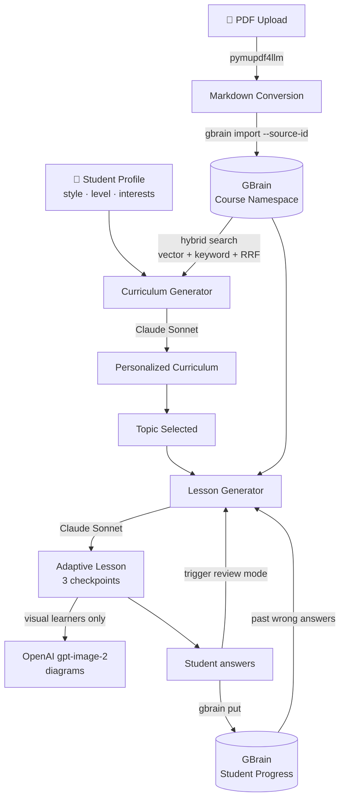

<div align="center">

# Glitch 

> *let's break the system*

**An adaptive learning platform that rewires any PDF around the way YOUR brain works.**

[](https://nextjs.org)
[](https://www.typescriptlang.org)
[](https://tailwindcss.com)
[](https://anthropic.com)
[](https://openai.com)
[](https://github.com/garrytan/gbrain)
[](https://ycombinator.com)

</div>

---

## What is Glitch?

Glitch is an adaptive learning platform powered by **GBrain** that builds a personalized curriculum from any PDF and teaches you in a way that matches how YOUR brain works.

Upload a textbook. Tell Byte what you're into. Watch your interests transform the content.

> 🎮 **Pokémon fan studying immunology?** Your macrophages become Pokémon defenders.
> 🏎️ **F1 fan learning AI?** Your neural networks race like lap times.
> ⚡ **Percy Jackson fan tackling calculus?** Limits become demigod quests.

---

## ✨ The Magic

- 🧬 **Same PDF, completely different experience** — Alex (visual, beginner, loves Pokémon) and Sam (theory, advanced, loves F1) get entirely different curricula, lesson styles, and content framing from *identical* source material.
- 🧠 **GBrain-powered memory** — every checkpoint answer is saved back to GBrain. Get something wrong, come back later, Byte remembers and rebuilds the lesson *specifically* around your weak spots.
- 🎨 **AI-generated diagrams** — visual learners get real AI-generated illustrations for every lesson section.
- 🤖 **Personalized loading commentary** — Byte cracks jokes connecting your interests to the topic while lessons load. No two waiting screens are the same.
- 📚 **Multi-course isolation** — each uploaded course lives in its own GBrain source namespace. No bleed-over between immunology and machine learning.
- 🔁 **Adaptive review mode** — return to a topic and Byte knows what you got wrong last time. The next lesson is rebuilt around those exact concepts.

---

## 🔧 How It Works



### Step-by-step

1. **PDF upload** → `pymupdf4llm` converts the deck to clean markdown → GBrain ingests it with `--source-id <slug>` for hard isolation between courses.
2. **GBrain hybrid search** (vector embedding + keyword + Reciprocal Rank Fusion) retrieves relevant chunks per query, scoped to a single course.
3. **Curriculum generation** — student profile (learning style, level, interests) + retrieved course content → Claude produces a JSON curriculum ordered for that specific learner.
4. **Each lesson** — GBrain retrieves topic-specific content *plus* the student's past progress page → Claude generates sections, examples, and **3 checkpoints**, each testing a different concept.
5. **Checkpoint answers** — saved back to GBrain as a markdown page at `students/<slug>-progress`, tagged with the `conceptTested` field for later retrieval.
6. **Review mode** — when you return to a topic, the client passes `previousAttempts` from `localStorage`; the API switches to a review prompt that focuses the new lesson on whatever you got wrong.
7. **Visual learners** — Claude's lesson output is run through OpenAI's `gpt-image-2` (via the Responses API) to generate clean educational diagrams for the first two sections.
8. **Loading screens** — Claude Haiku generates a batch of 10 personalized punny messages connecting your interests to the topic, with a silent background refill before the queue runs out.

---

## 🧪 Tech Stack

| Layer | Tech |
|---|---|
| Framework | **Next.js 14** (App Router, React Server Components) |
| Language | **TypeScript** |
| Styling | **Tailwind CSS** + custom CSS animations |
| Knowledge layer | **GBrain** — persistent knowledge graph, hybrid RAG, student memory |
| Curriculum & lessons | **Claude** (`claude-sonnet-4-20250514`) via Anthropic SDK |
| Loading vibes | **Claude Haiku** (`claude-haiku-4-5-20251001`) — fast, cheap, punny |
| Diagrams | **OpenAI** (`gpt-image-2` via the Responses API) |
| PDF parsing | **pymupdf4llm** |
| Profile storage | `localStorage` (no server-side user DB) |

---

## 🔑 API Keys Required

Create a `.env.local` in the project root:

```bash
ANTHROPIC_API_KEY=sk-ant-...     # https://console.anthropic.com
OPENAI_API_KEY=sk-proj-...       # https://platform.openai.com
GEMINI_API_KEY=AIza...           # https://aistudio.google.com (optional fallback)
```

---

## 🚀 Setup

```bash
# 1. Install dependencies
npm install

# 2. Install GBrain
git clone https://github.com/garrytan/gbrain
cd gbrain && bun install && bun link
cd ..

# 3. Initialize GBrain with PGLite (local, no external DB)
gbrain init --pglite

# 4. Install the PDF parser
pip install pymupdf4llm

# 5. Add API keys to .env.local (see above)

# 6. Run the dev server
npm run dev
```

Then visit **[localhost:3000](http://localhost:3000)** → onboard → upload a PDF → start learning.

---

## 🎭 Demo Personas

Three pre-built profiles to feel the difference in seconds. Pick one on the onboarding screen.

| Persona | Learning Style | Level | Lesson Length | Interests | What you'll see |
|---|---|---|---|---|---|
| **Alex** 🎴 | Visual | Beginner | Short | Pokémon | Emoji-rich lessons, **AI-generated diagrams**, gentle pacing, Pokémon-themed analogies |
| **Sam** 🏁 | Theory | Advanced | Deep dives | F1 racing | Dense academic prose, no images, technical depth, racing metaphors |
| **Jordan** ⚡ | Examples | Intermediate | Medium | Percy Jackson | Narrative-driven explanations, mythology-flavored examples |

**Try this**: upload the same PDF, switch between Alex and Sam, generate a curriculum twice. The two experiences barely overlap.

---

## 📁 Project Structure

```
glitch/
├── app/
│   ├── page.tsx                  # Landing — Glitch hero + Byte
│   ├── onboarding/page.tsx       # 5-question chat with Byte
│   ├── dashboard/page.tsx        # Course selector + personalized curriculum
│   ├── upload/page.tsx           # PDF ingest with vibe commentary
│   ├── lesson/page.tsx           # Adaptive lesson + 3 checkpoints
│   └── api/
│       ├── curriculum/route.ts   # GBrain → Claude → JSON curriculum
│       ├── lesson/route.ts       # Lesson gen, answer eval, image gen
│       ├── checkpoint/route.ts   # Persist checkpoint results to GBrain
│       ├── ingest/route.ts       # PDF → markdown → GBrain import
│       ├── vibe/route.ts         # Claude Haiku loading commentary
│       └── chat/route.ts         # General Byte chat endpoint
├── components/
│   ├── Byte.tsx                  # Mascot — 4 mood-keyed PNGs
│   ├── SpeechBubble.tsx
│   └── PillButton.tsx
└── lib/
    ├── gbrain.ts                 # GBrain CLI wrapper + source-id filter
    ├── claude.ts                 # Anthropic SDK + JSON extractor
    └── profile.ts                # localStorage helpers, slugify, types
```

---

## 🏗️ Built at YC GStack × GBrain Hackathon

Built in one day using **GStack** for the development workflow and **GBrain** as the core memory and RAG layer. The whole point of the demo: prove that personalized, adaptive learning is a thing you can ship in 24 hours when the retrieval and memory layers are already solved for you.

<div align="center">

---

*Built with 🧠 by humans, taught by a tiny gremlin named Byte.*

</div>
